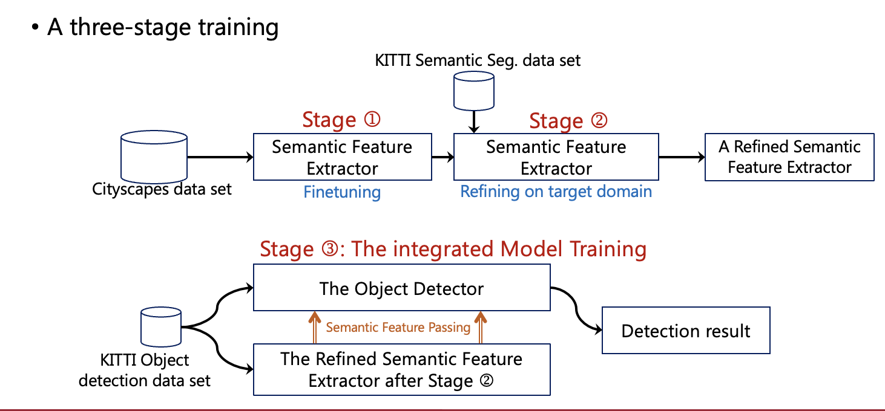

# SegAttnDetec
This is the official implementation of the paper:
  * [SegAttnDetec: A Segmentation-Aware Attention-Based Object Detector](https://www.sciencedirect.com/science/article/pii/S187705092501018X)


**Model Architecture**
---


**Training Strategy**
---


**Experimental Results on the KITTI 2D Object Detection Dataset**
---
### Overall comparison of SegAttnDetec against key existing DL-based object detectors

| Model            | Backbone               | Easy mAP (%) | Moderate mAP (%) | Hard mAP (%) | Overall mAP (%) | # of Tr. params | Improvement (%) |
|------------------|------------------------|--------------|------------------|--------------|-----------------|-----------------|-----------------|
| Faster R-CNN     | VGG-16 (baseline)      | 83.16        | 88.97            | 72.62        | 81.58           | -               | -               |
| Faster R-CNN     | ResNet-50              | 83.08        | 79.28            | 73.71        | 78.69           | 41.1M           | -3.5            |
| Yolov5           | -                      | -            | -                | -            | 63.60           | 14.0M           | -22.0           |
| BiGA-YOLO        | -                      | -            | -                | -            | 68.30           | 11.9M           | -16.3           |
| SegAttnDetec (proposed) | ResNet-50 (OD) + ResNet-101 (sem-seg) | 86.64 | 81.86 | 79.69 | 83.52 | 52.1M | +2.4 |

*Note: Improvement % compared to the baseline, # of Tr. params = number of trainable parameters.*

### Class-wise performance comparison (mAP %)

| Object class | Easy (FR-CNN) | Easy (SegAttnDetec) | Moderate (FR-CNN) | Moderate (SegAttnDetec) | Hard (FR-CNN) | Hard (SegAttnDetec) |
|--------------|---------------|---------------------|-------------------|-------------------------|---------------|---------------------|
| Car          | 84.81         | 97.22               | 86.18             | 89.70                   | 78.03         | 88.90               |
| Pedestrian   | 76.52         | 79.96               | 59.98             | 73.92                   | 51.84         | 66.62               |
| Cyclist      | 74.72         | 78.59               | 56.83             | 70.50                   | 49.60         | 68.86               |

**Environment** 
---
```bash
torch==2.1.2
torchvision==0.16.2
lightning==2.4.0
lightning_utilities==0.11.8
```
